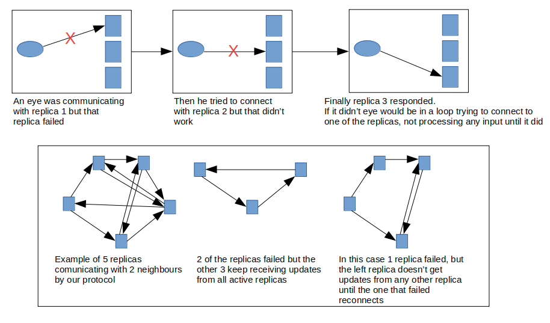
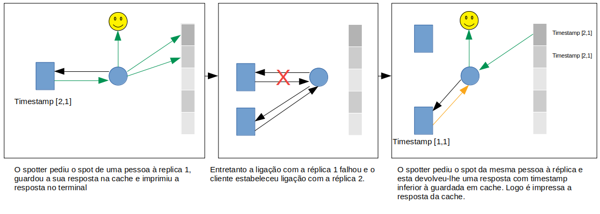

# Relatório do projeto Sauron

Sistemas Distribuídos 2019-2020, segundo semestre

## Autores

**Grupo A47**

| Number | Name                    | User                             | Email                                 |
| -------|-------------------------|----------------------------------| --------------------------------------|
| 74224  | Pedro Magalhães         | https://github.com/mavape        | <mailto:ist174224@tecnico.ulisboa.pt> |
| 89454  | Guilherme Ribeiro       | https://github.com/guimribeiro   | <mailto:ist189454@tecnico.ulisboa.pt> |
| 90739  | João Vieira             | https://github.com/jvieiratpt    | <mailto:ist190739@tecnico.ulisboa.pt> |

## Melhorias da primeira parte

- [Clean the observation list after the report of observations by the eye client](https://github.com/tecnico-distsys/A47-Sauron/commit/a0d53576fc3ae08c405bebd8fe9b260f955176cd)
- [Validation of the camera name length by the eye client](https://github.com/tecnico-distsys/A47-Sauron/commit/258dd6cccfc37e75bb43145d7ba7ebf7d9798fef)
- [Implement info command in the spotter client (CamInfo)](https://github.com/tecnico-distsys/A47-Sauron/commit/1d46ac982d804201111726d5d28decc848c949fa)
- [Synchronization](https://github.com/tecnico-distsys/A47-Sauron/commit/80220f0ca7a85097cf5408dced845cfeea416abb)
- [Correct domain package](https://github.com/tecnico-distsys/A47-Sauron/commit/80220f0ca7a85097cf5408dced845cfeea416abb#diff-e20ccf7dd9192f9356a99a298e1c156c)

## Modelo de faltas

Faltas não toleradas:
- Faltas do Zookeeper
- Falhas bizantinas
- Caso determinados subconjuntos de réplicas falhem, as atualizações das réplicas ativas podem não chegar a todas as
  réplicas ativas
- No caso de o spotter encontrar uma pessoa através do comando spot, este pode não encontrar a mesma pessoa através do 
  comando trail, uma vez que as suas caches são diferentes
- A cache é limitada, pelo que, no spotter, um comando pode retornar valores desatualizados ao fim de algum tempo
- As réplicas não têm memória persistente, pelo que caso sejam desligadas não irão recuperar a memória que já possuíam
- Duas câmaras com o mesmo nome mas com coordenadas diferentes poderão conectar-se caso as réplicas às quais se tenham
  conectado ainda não tenham recebido gossips referentes à outra
- Caso um cliente se queira conectar a uma réplica específica e esta estiver em baixo é retornada uma mensagem de erro e
  o cliente fecha

Faltas toleradas:
- Caso o eye ou o spotter esteja conectado a uma replica e esta falhe, este consegue conectar-se a outra replica ativa
- Se o numero de replicas que falhar for menor do que o numero de vizinhos de cada replica, entao os gossips das
  replicas ativas irão eventualmente chegar a todas as outras réplicas ativas (para raras exceções não se verifica)
- A cache mantem leituras coerentes no cliente para pedidos iguais
- Caso as replicas nao estejam todas conectadas aquando de comunicações com eyes, estas irão receber os dados
  provenientes dos eyes através de gossip quando se reconectarem
- Caso uma tentativa de gossip falhe, a próxima tentativa de gossip irá incluir os updates que a anterior tentativa 
  incluía  

## Solução

Tanto o eye como o spotter ficam em ciclo até se conseguirem conectar com uma das réplicas ativas. Caso esta falhe,
aquando do envio do próximo pedido, estes clientes tentarão conectar-se a outra réplica, para a qual enviarão o seu
pedido.

Diagrama sobre o protocolo gossip explicado na parte opções de implementação.

Está implementada uma cache no frontend de pedidos resposta com um tamanho limite que é configurável para cada tipo
de pedido. Ou seja, existe uma cache para pedidos de track, uma para pedidos de trackMatch, uma para pedidos de trace e
uma para pedidos de camInfo. A cache guarda cada pedido efetuado pelo cliente com um timestamp associado. Este
timestamp corresponde ao timestamp da réplica que lhe respondeu ao pedido no momento em que respondeu. Quando um cliente 
efetua um pedido, este primeiramente espera pela resposta do servidor. Seguidamente, verifica se tem alguma resposta 
para este pedido em cache. Se tiver, irá comparar os timestamps das respostas da cache e da réplica. Apenas irá retornar 
a resposta da réplica se esta tiver um timestamp maior ou igual ao guardado em cache. Caso o da cache seja maior ou 
concurrente, é devolvida a resposta da cache. Se a cache estiver completa e for realizado mais um pedido da parte do
cliente, então este pedido irá substituir o mais antigo. A cache sabe qual é o mais antigo porque para cada resposta
guardada é incrementado um index, guardado em conjunto com a resposta. Logo a cache irá substituir o pedido com o index
mais baixo.

## Protocolo de replicação

O objeto Storage (o nosso armazém de dados) possui agora um objeto gossipManager.
Toda a parte de gossip é implementada na package gossip. Sempre que o storage recebe informação de um eye, esta é 
enviada para o gossipManager. Sempre que o storage recebe uma atualização de uma réplica, esta é enviada para o 
gossipManager que devolve apenas os updates que o Storage deve guardar. É também o gossipManager o responsável por 
enviar os pedidos de gossip para os vizinhos da réplica, sendo ele que trata de toda a parte de gossip. Protocolo 
explicado a seguir.

O número de réplicas é conhecido à partida por todas as réplicas através da introdução do valor na linha de comandos.
Os vizinhos de cada réplica são as réplicas para as quais esta irá enviar pedidos de gossip. O número de vizinhos é
calculado pela função getNumNeighbours que neste momento obtém o número de vizinhos dividindo o número de réplicas por
3, mas é facilmente alterada no código.

Cada réplica guarda as suas atualizações e as atualizações de outras réplicas no seu log de updates. De cada vez que faz
gossip com outra réplica, envia este log. Caso a réplica confirme a receção do log, a que envia irá assumir que esta já
recebeu aquele conjunto de updates e portanto não o irá mandar novamente para esta. Por outro lado, a que recebe irá
também saber que não deve enviar aquele conjunto de updates para a que envia.
Todas as comparações das versões entre réplicas são feitas através de um timestamp vetorial.
De cada vez que uma réplica recebe um update de outra, a primeira faz merge do seu timestamp com a segunda, ficando
com o timestamp merged.

Um update é considerado como sendo um report ou um cam join, portanto pode conter uma lista de observações ou uma 
câmera. Cada update tem uma versão que corresponde ao número de atualizações que a réplica que envia o update para as
outras já fez. Os updates de cada réplica são enviados numa lista de updates. Cada gossip entre réplicas corresponde
ao envio de n listas de updates, em que 'n' corresponde ao número total de réplicas.

## Opções de implementação
O gossip de cada réplica é efetuado apenas para um subconjunto de réplicas e não para todas, uma vez que para um número
elevado de réplicas, o número de mensagens enviadas na rede seria muito elevado (o quadrado do número de réplicas) e a
falha de uma réplica poderia pôr todas as outras em espera. Para além de que seriam recebidos muitos updates por parte 
de cada réplica,possivelmente em simultâneo, o que iria fazer com que esta utilizasse a maioria dos seus recursos para o
update e não para a comunicação com os clientes.
No ficheiro GossipManager presente no silo-server, a função findNeighbours permite que cada réplica calcule quais são os
seus vizinhos. A melhor solução que encontrámos foi a de as réplicas contactarem as próximas numa sequência, ou seja, 
tendo 9 réplicas e cada uma a fazer gossip com outras 3 ter-se-ia:
- A replica 1 envia gossip para a 2, a 3 e a 4
- A replica 2 envia gossip para a 5, a 6 e a 7
- A replica 3 envia gossip para a 8, a 9 e a 1
- A replica 4 envia gossip para a 2, a 3 e a 5 e assim por diante...
A vantagem desta solução em relação a por exemplo comunicar com as 3 seguintes a esta (a 1 com a 2,3,4; a 2 com a 3,4,5)
é a de que para um elevado número de réplicas a propagação de gossips é mais rápida para todas elas. Para por exemplo,
20 replicas, uma atualização da réplica 1 apenas chegaria à 20 ao fim de 7 rondas de gossip para este último exemplo, ao 
passo que para a nossa solução apenas seriam precisas apenas 2. Nem todas recebem as atualizações ao fim de 2 rondas,
mas algo aproximado.

Quando uma réplica detetar que todos os seus vizinhos já possuem um determinado conjunto de updates, esta irá apagar
estes updates do seu log.

A cache é uma cache de pedidos-resposta, pois uma cache que fosse uma réplica parcial seria de uma complexidade
razoavelmente mais elevada, sendo que a cache de pedidos-respostas corrige quase todas as incoerências nas leituras.

## Notas finais

Tendo em conta a complexidade da arquitetura de gossip criada e a dificuldade em fazer testes, apesar de se ter feito
um número bastante razoável de testes, é possível que ainda haja alguns bugs não detetados